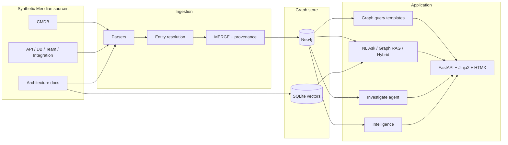

# Enterprise Dependency Intelligence

A knowledge-graph application that answers **how enterprise systems depend on each other**—with every claim traceable to graph evidence and its source system.

It is built around a fictional retail enterprise, **Meridian Retail Group**, so the product can be developed and demoed end-to-end without real company data.

---

## The problem

Large enterprises run hundreds of applications, APIs, services, databases, pipelines, and reports. Dependency knowledge is scattered across CMDB/ServiceNow, API catalogs, data catalogs, integration lists, spreadsheets, and people’s heads.

That fragmentation makes everyday questions expensive:

- What breaks if we retire this API?
- Who needs to be in the room before we change this database?
- How does traffic from the storefront reach payments?
- Where is the same technology duplicated across teams?

**Enterprise Dependency Intelligence** connects those fragmented catalogs into one dependency graph so architects, TPMs, and engineers can discover impact and ownership from evidence—not tribal knowledge.

---

## What the product does today

The current product covers search through advanced intelligence (MVP1–MVP5). Core paths stay deterministic; LLMs are optional and gated.

### Dependency explorer

- **Search** applications, services, APIs, databases, pipelines, reports, external systems, teams, and capabilities by name
- **Entity detail** with metadata, owners, criticality, lifecycle, and provenance
- **Direct and multi-hop** upstream/downstream dependencies
- **Interactive dependency graph** (zoom, fit, full page) with typed edges such as `CONSUMES`, `READS_FROM`, `WRITES_TO`, `INTEGRATES_WITH`
- **Shortest and alternate paths** between two systems
- **Ownership and stakeholder rollup** across a dependency subtree
- **Business capability** views for “what business function does this support?”
- **Evidence panel** on answers: source system, relationship type, documented vs inferred

### Ask (natural language)

- **Seven closed templates** answered by deterministic graph queries (no LLM)—or an explicit “not supported” when the question is out of scope
- **Open-ended Ask** (optional): Graph RAG over a retrieved subgraph when `GRAPH_RAG_ENABLED=true`
- **Hybrid Ask** (optional): fuse architecture-doc passages with the subgraph when `HYBRID_DOC_RAG_ENABLED=true`
- Answers **cite only retrieved evidence** and refuse when evidence is insufficient

### Investigate

- Separate **Investigate** flow for multi-step change-impact style questions
- Always runs a required **evidence skeleton**, then up to N **allowlisted** graph/doc tools
- Returns a grounded **report**, citations, and a compact **step trace**
- Opt-in via `AGENTIC_INVESTIGATION_ENABLED` (Ask stays single-shot)

### Intelligence

- **Change risk** scores from criticality, lifecycle, blast radius, fan-in, ownership gaps, and capabilities
- **What-if retirement** simulation (read-only—never mutates the graph)
- **Team pages** roll up risk across systems the team owns
- **Drift signals**: deprecated/retired still consumed, `REPLACED_BY` with consumers, unresolved ingestion references
- **Technology rationalization**: Applications/Services by `technology`, Databases by `engine`
- Optional LLM **narrative** over computed factors only (`INTELLIGENCE_NARRATIVE_ENABLED`)

### Data & trust

- Synthetic Meridian sources: CMDB, API Catalog, DB Metadata, Team Ownership, Integration Catalog, plus architecture docs
- Idempotent ingestion with natural keys and full provenance
- After each ingest, a **dry-run reconciliation report** lists graph members that no longer appear in sources (no auto-delete)

---

## Architecture

Local-first stack: generate/ingest catalogs into Neo4j, then serve FastAPI + server-rendered UI. Query templates are shared by the explorer, closed Ask, and higher layers.



| Layer | Role |
|--------|------|
| `src/datagen/` | Deterministic Meridian sample data |
| `src/ingestion/` | Parsers, resolution, MERGE load, recon dry-run |
| `src/graph/` | `GraphStore` protocol, Neo4j + NetworkX/SQLite fallback, Cypher-style queries |
| `src/nlquery/` | Closed templates + optional Graph/Hybrid RAG |
| `src/investigate/` | Bounded agentic investigation |
| `src/intelligence/` | Risk, what-if, drift, rationalization |
| `src/retrieval/` | Doc chunking / embeddings for Hybrid Ask |
| `src/api/` + `src/web/` | HTTP API and UI |

**Design rules that shape the system:**

1. **Evidence first** — never assert a dependency that isn’t in the graph (or retrieved docs) with provenance.
2. **Layered AI** — structured explorer and closed Ask stay LLM-free; open Ask, Investigate, and narrative are explicit opt-ins.
3. **Same graph for every milestone** — MVP2–5 extend retrieval and UI without rebuilding the ontology.
4. **ADRs for decisions** — store choice, resolution, provenance, NL boundary, RAG, Investigate, intelligence, reconciliation live under `docs/01_architecture/DECISIONS/`.

Deeper detail: [`docs/01_architecture/ARCHITECTURE.md`](docs/01_architecture/ARCHITECTURE.md) and [`docs/01_architecture/DATA_MODEL.md`](docs/01_architecture/DATA_MODEL.md).

---

## How it is built

### Delivery model

Work is tracked as **increments** mapped to functional requirements in [`docs/00_project/PRODUCT_BRIEF.md`](docs/00_project/PRODUCT_BRIEF.md). Significant technical choices are recorded as **ADRs**. Runtime product code lives only under `src/`; agent/review tooling is build-time, not part of the running app.

Operating rules for coding agents: [`AGENTS.md`](AGENTS.md).

### Quality bar

| Practice | Where |
|----------|--------|
| Unit / integration tests | `tests/` |
| Golden NL and faithfulness evals | `evals/` |
| Post-ingest data-quality checks | `src/quality/` |
| Eval strategy (closed + RAG + Investigate + intelligence) | `docs/02_testing/EVAL_STRATEGY.md` |

New behavior is expected to ship with tests (and evals when answers or agents are involved). Fake-LLM tests gate commits that touch generative paths so CI does not need live OpenAI.

### Milestone history

| Milestone | Outcome |
|-----------|---------|
| MVP1 | Deterministic explorer + 7 closed NL questions + evidence |
| MVP2 | Open-ended Graph RAG Ask |
| MVP3 | Hybrid graph + document RAG |
| MVP4 | Bounded agentic Investigate |
| MVP5 | Risk, what-if, drift, technology rationalization |

Each milestone kept prior surfaces working; optional AI features are flag-gated.

---

## Repository layout

```
src/          Runtime application (datagen, ingestion, graph, nlquery, investigate, intelligence, api, web)
tests/        Unit and integration tests
evals/        Golden / faithfulness evaluation scenarios
data/sample/  Generated synthetic Meridian datasets (regenerable)
docs/         Charter, product brief, architecture, ADRs, test strategy, runbook, release notes
AGENTS.md     Rules for AI coding agents working in this repo
```

---

## Getting started

Local setup (Python venv, Neo4j via Docker, ingest, run the app, tests) is documented in:

**[`docs/03_operations/RUNBOOK.md`](docs/03_operations/RUNBOOK.md)**

Typical flow once prerequisites are in place:

```bash
python -m src.datagen.generate
python -m src.ingestion.run
uvicorn src.api.main:app --reload --host 127.0.0.1 --port 8001
```

Copy `.env.example` → `.env` for graph connection and optional feature flags (`GRAPH_RAG_ENABLED`, `HYBRID_DOC_RAG_ENABLED`, `AGENTIC_INVESTIGATION_ENABLED`, `INTELLIGENCE_NARRATIVE_ENABLED`). Never commit `.env`.

---

## Further reading

| Doc | Contents |
|-----|----------|
| [`docs/00_project/PROJECT_CHARTER.md`](docs/00_project/PROJECT_CHARTER.md) | Problem, goals, constraints |
| [`docs/00_project/PRODUCT_BRIEF.md`](docs/00_project/PRODUCT_BRIEF.md) | Personas, FRs, out of scope |
| [`docs/01_architecture/ARCHITECTURE.md`](docs/01_architecture/ARCHITECTURE.md) | Components and request flow |
| [`docs/01_architecture/DECISIONS/`](docs/01_architecture/DECISIONS/) | Architecture Decision Records |
| [`docs/03_operations/RELEASE_NOTES.md`](docs/03_operations/RELEASE_NOTES.md) | What shipped per milestone |
