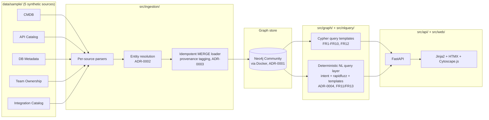

# Architecture

Status: accepted

Read by: Solution Architect Agent, Refactor Reviewer Agent, Code Reviewer Agent, `architecture-review` skill, `knowledge-graph-modeling-review` skill, `graph-rag-retrieval-review` skill (from MVP2), and most stack-specific review skills.

## Overview

MVP1 is a single-process, local-first application: synthetic source files are ingested into a Neo4j graph, and a FastAPI + server-rendered UI answers dependency questions by running parameterized Cypher against that graph. There is no LLM anywhere in this diagram — every box is deterministic code.

## Components

| Component | Responsibility | Location |
|-----------|-----------------|----------|
| Synthetic data generators | Deterministically generate the 5 MVP1 source datasets for the "Meridian Retail Group" scenario. | `src/datagen/`, output → `data/sample/` |
| Source parsers | Parse each source format into a common in-memory `(entities, relationships)` shape. One parser per source, behind the `SourceParser` extension point. | `src/ingestion/parsers/` |
| Entity resolution | Resolve a parsed record to a stable node `id`: exact natural-key match first, `rapidfuzz` normalized-match fallback, unresolved queue otherwise. No LLM. | `src/ingestion/resolution.py` |
| Ingestion loader | Idempotent `MERGE`-based writer that tags every node/relationship with provenance (`source_system`, `source_record_id`, `evidence_type`). Runs sources in order: CMDB → API Catalog → DB Metadata → Team Ownership → Integration Catalog. | `src/ingestion/loader.py` |
| Graph store adapter | Uniform interface over the actual graph backend, behind the `GraphStore` extension point (ADR-0001). | `src/graph/store.py` (Neo4j driver-backed); `src/graph/store_fallback.py` (NetworkX+SQLite, only if the primary store is unreachable) |
| Query templates | Parameterized Cypher (or fallback-store equivalent) implementing FR1–FR10 and FR12: search, detail, direct/transitive traversal, path finding, ownership rollup, capability view, evidence lookup. | `src/graph/queries.py` |
| NL query layer | Deterministic intent classification → entity resolution → template dispatch for the 7 closed questions (FR11/FR13). When `GRAPH_RAG_ENABLED`, unmatched questions use open-ended subgraph retrieval + `LLMAnswerGenerator` (`ADR-0005`, FR14–FR16). | `src/nlquery/` |
| API layer | FastAPI routes exposing search, detail, traversal, paths, ownership, capabilities, NL query, and evidence endpoints. | `src/api/` |
| UI layer | Server-rendered Jinja2 templates + HTMX for interactivity + Cytoscape.js (CDN) for subgraph visualization (FR5). No SPA build step. | `src/web/templates/`, `src/web/static/` |
| Data quality checks | Automated checks for orphan nodes, duplicate natural keys, and referential consistency, run after ingestion and in CI. | `src/quality/`, `tests/` |
| Golden dataset & evals | One scenario per supported NL question (and key FR behaviors) with expected entities/relationships/paths; must hit 100% pass. | `evals/` |

## Runtime workflow

**Ingestion (offline, run on demand — not per-request):**

1. `src/datagen/` writes the 5 synthetic source files to `data/sample/` (run once, or whenever the scenario dataset needs to grow).
2. Each file is parsed by its `SourceParser` into `(entities, relationships)`.
3. Entity resolution assigns/confirms each record's stable natural-key `id` (`ADR-0002`).
4. The loader `MERGE`s nodes and relationships into Neo4j, tagging provenance (`ADR-0003`), in the fixed source order above so that, e.g., an API referenced by the Integration Catalog before the API Catalog runs still resolves correctly on re-ingestion.
5. Data-quality checks run against the resulting graph (orphans, duplicates, referential consistency) and fail loudly if violated.

**Request-time (per user interaction):**

1. A user action in the UI (search box, entity page, "find path" form, NL question box) triggers an HTMX request to a FastAPI route.
2. Structured/templated routes (FR1–FR10, FR12) call `src/graph/queries.py` directly with the request's parameters.
3. The NL query route (FR11/FR13/FR14) first classifies intent via `src/nlquery/`. Matching closed templates dispatch to the *same* FR1–FR10 query templates and `TemplateAnswerGenerator`. Unmatched questions: if Graph RAG is disabled, return FR13's explicit non-answer; if enabled, run open-ended subgraph retrieval then `LLMAnswerGenerator` (`ADR-0005`). Entity resolution failures still return not-found / ambiguous rather than guessing.
4. FastAPI renders the result via a Jinja2 partial, returned to HTMX for in-place DOM swap. Subgraph results additionally emit Cytoscape.js-ready JSON for client-side rendering (FR5).
5. Every rendered answer includes its evidence (source system(s), relationship types, and — for paths — the full path) per FR12, sourced from the same query/retrieval result, never re-derived separately.

## Extension points

Named interface seams, kept in sync with `extensions` in `sdlc.project.yaml`:

| Extension point | Protocol location | MVP1 implementation | Future swap-in |
|---|---|---|---|
| `graph_store` | `src/graph/store.py::GraphStore` (Protocol) | Neo4j Community via Docker (`ADR-0001`) | NetworkX+SQLite fallback if the remote Docker host is unreachable; a managed/clustered Neo4j later if this ever left "local-first" |
| `source_parser` | `src/ingestion/parsers/base.py::SourceParser` (Protocol) | One parser per MVP1 source (5 total) | New source types (e.g. cloud asset inventory) add a new parser without touching the loader or resolution logic |
| `entity_resolver` | `src/ingestion/resolution.py::EntityResolver` (Protocol) | Exact natural-key → `rapidfuzz` fallback → unresolved queue (`ADR-0002`) | Embedding-based resolution if fuzzy matching proves insufficient at larger scale |
| `answer_generator` | `src/nlquery/answering.py::AnswerGenerator` (Protocol) | Deterministic string templates for closed questions (`ADR-0004`); OpenAI `LLMAnswerGenerator` for open-ended when Graph RAG is on (`ADR-0005`) | Local LLM or alternate hosted provider behind the same Protocol |

## Key technical decisions

See `docs/01_architecture/DECISIONS/` for full ADRs:

- [`ADR-0001-graph-store-selection.md`](DECISIONS/ADR-0001-graph-store-selection.md) — Neo4j Community Edition via Docker, with an embedded fallback.
- [`ADR-0002-entity-resolution-strategy.md`](DECISIONS/ADR-0002-entity-resolution-strategy.md) — deterministic natural keys first, `rapidfuzz` fallback, no LLM.
- [`ADR-0003-provenance-model.md`](DECISIONS/ADR-0003-provenance-model.md) — universal provenance fields on every node/relationship from day one.
- [`ADR-0004-deterministic-nl-query-layer.md`](DECISIONS/ADR-0004-deterministic-nl-query-layer.md) — zero-LLM NL query layer for MVP1, closed 7-question answer space.
- [`ADR-0005-graph-rag-tooling.md`](DECISIONS/ADR-0005-graph-rag-tooling.md) — MVP2 open-ended Graph RAG: OpenAI + structured subgraph retrieve, no Text2Cypher v1.
