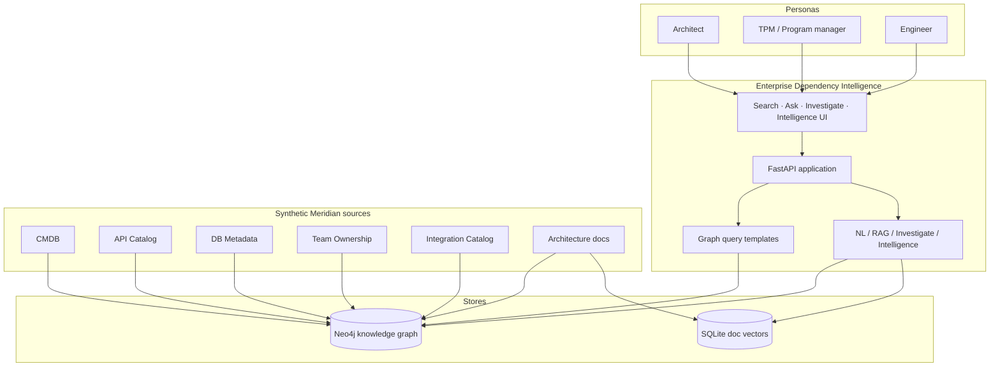

# 01 — System context

Who uses the product, and what external systems it depends on.

**Notes**

- All catalog data is fictional Meridian Retail Group content from `src/datagen/`.
- Provenance on every node/relationship ties answers back to a source system (`ADR-0003`).
