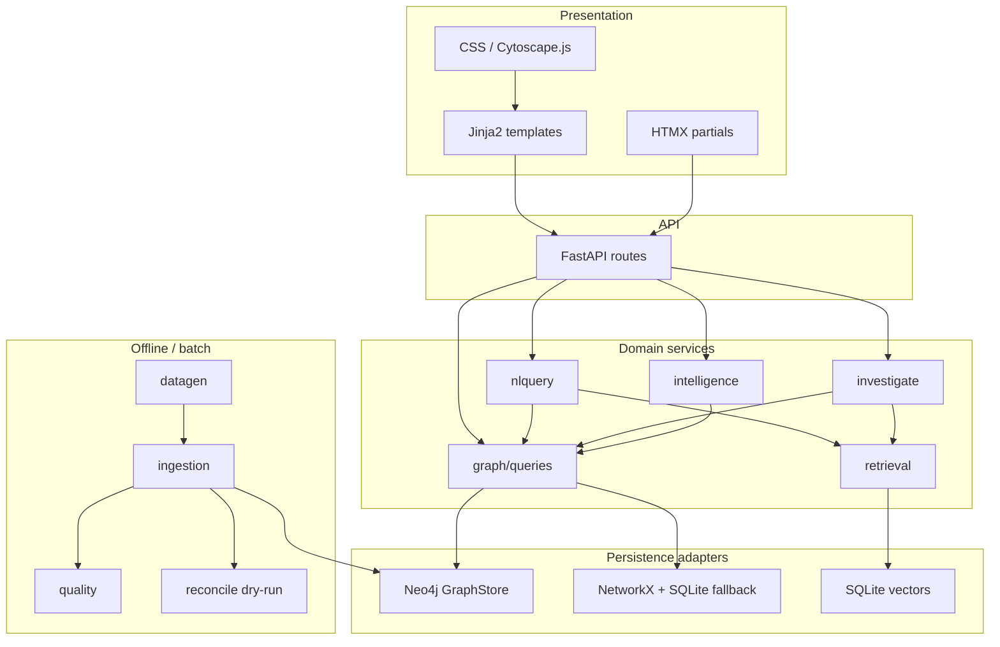

# 02 — Runtime components

Package-level map of the running application (`src/`).

**Design rule:** explorer and closed Ask call the same `queries` templates that Investigate tools and Intelligence scoring reuse—one graph contract for every milestone.
