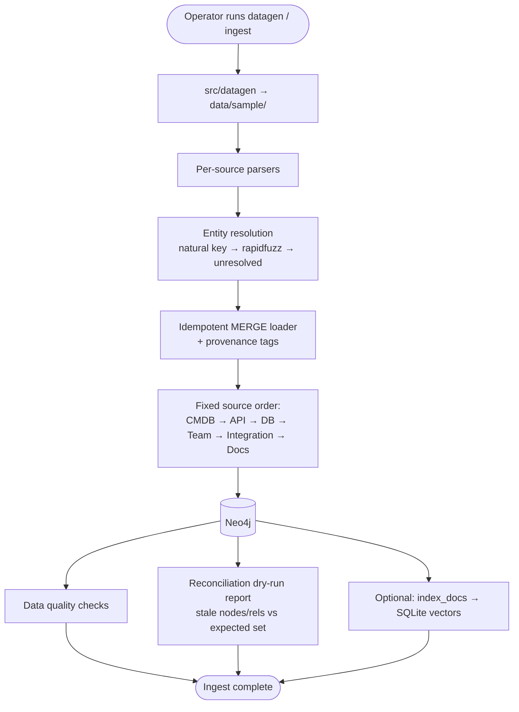
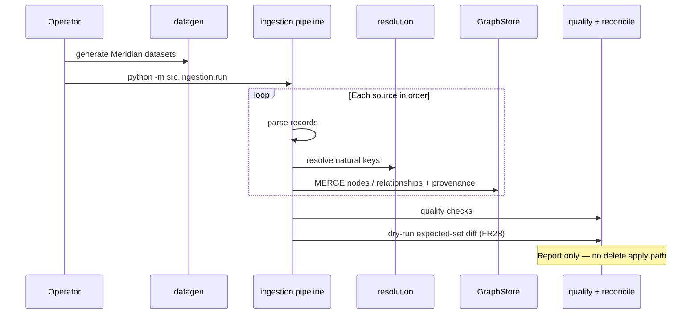

# 03 — Ingestion flow

Offline pipeline: generate synthetic sources, load the graph, then report (never auto-delete) drift vs sources.

```mermaid
flowchart TD
  Start([Operator runs datagen / ingest]) --> Gen[src/datagen → data/sample/]
  Gen --> Parse[Per-source parsers]
  Parse --> Resolve[Entity resolution<br/>natural key → rapidfuzz → unresolved]
  Resolve --> Load[Idempotent MERGE loader<br/>+ provenance tags]
  Load --> Order[Fixed source order:<br/>CMDB → API → DB → Team → Integration → Docs]
  Order --> Neo4j[(Neo4j)]
  Neo4j --> IndexDocs[Optional: index_docs → SQLite vectors]
  Neo4j --> Quality[Data quality checks]
  Neo4j --> Recon[Reconciliation dry-run report<br/>stale nodes/rels vs expected set]
  Quality --> Done([Ingest complete])
  Recon --> Done
  IndexDocs --> Done
```

```mermaid
sequenceDiagram
  participant Op as Operator
  participant DG as datagen
  participant Pipe as ingestion.pipeline
  participant Res as resolution
  participant GS as GraphStore
  participant RQ as quality + reconcile

  Op->>DG: generate Meridian datasets
  Op->>Pipe: python -m src.ingestion.run
  loop Each source in order
    Pipe->>Pipe: parse records
    Pipe->>Res: resolve natural keys
    Pipe->>GS: MERGE nodes / relationships + provenance
  end
  Pipe->>RQ: quality checks
  Pipe->>RQ: dry-run expected-set diff (FR28)
  Note over RQ: Report only — no delete apply path
```

See `ADR-0002`, `ADR-0003`, `ADR-0009`.
