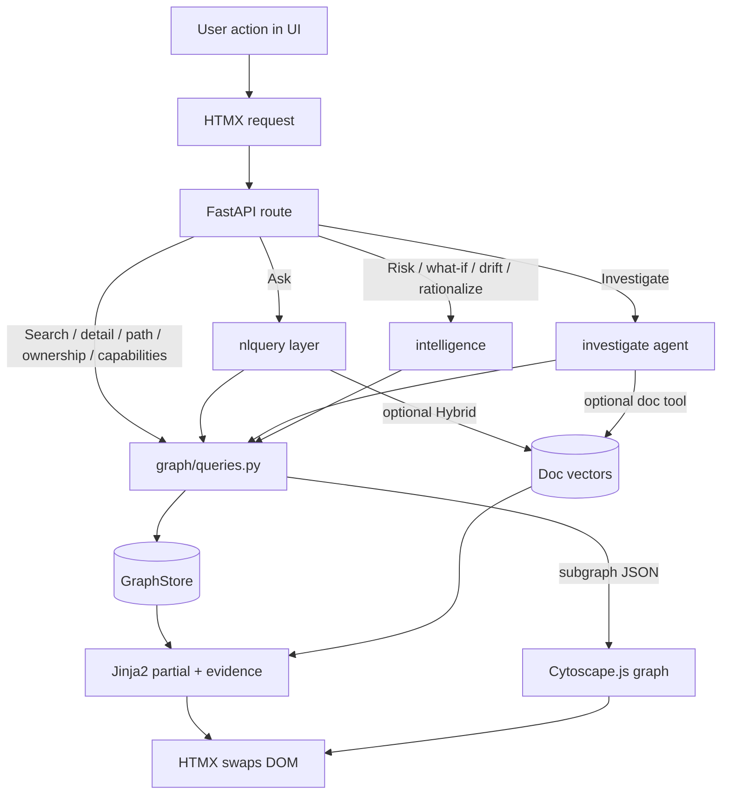
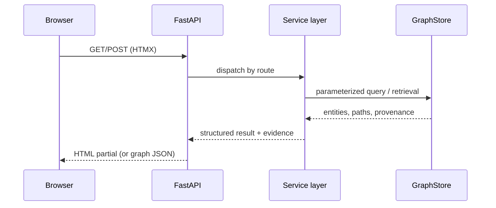

# 04 — Request-time flow

How a UI action becomes an evidence-backed HTML partial.

Structured FR1–FR10 paths never call an LLM. Ask / Investigate / narrative are flag-gated (`ADR-0004`–`ADR-0008`).
