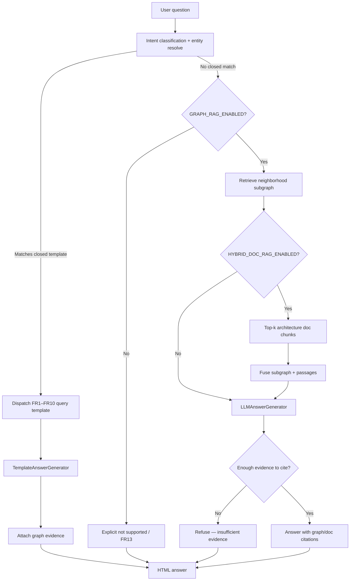

# 05 — Ask decision flow

Closed templates first; optional Graph RAG / Hybrid only when flags are on.

**Invariant:** answers may only cite retrieved graph/doc evidence—never free invent (`ADR-0005`, `ADR-0006`).
