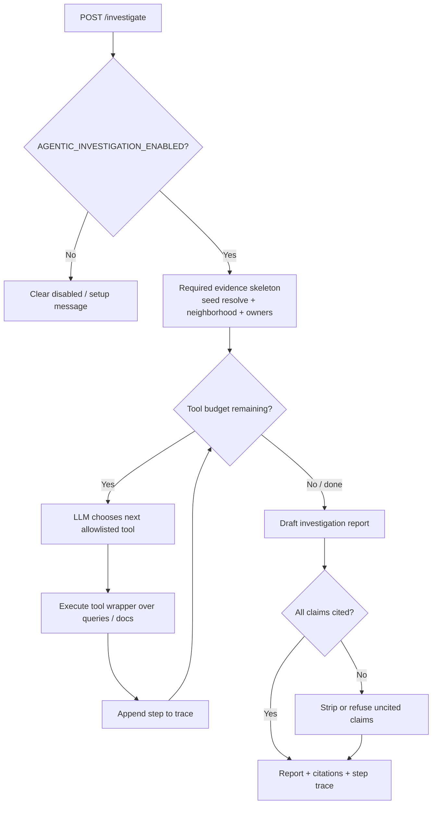
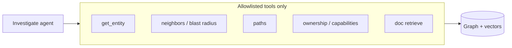

# 06 — Investigate flow

Bounded multi-step investigation (separate from single-shot Ask).

```mermaid
flowchart TD
  Start[POST /investigate] --> Flag{AGENTIC_INVESTIGATION_ENABLED?}
  Flag -->|No| Disabled[Clear disabled / setup message]
  Flag -->|Yes| Skeleton[Required evidence skeleton<br/>seed resolve + neighborhood + owners]
  Skeleton --> Loop{Tool budget remaining?}
  Loop -->|Yes| Plan[LLM chooses next allowlisted tool]
  Plan --> Tool[Execute tool wrapper over queries / docs]
  Tool --> Trace[Append step to trace]
  Trace --> Loop
  Loop -->|No / done| Draft[Draft investigation report]
  Draft --> CiteGate{All claims cited?}
  CiteGate -->|No| Strip[Strip or refuse uncited claims]
  CiteGate -->|Yes| Report[Report + citations + step trace]
  Strip --> Report
```

```mermaid
flowchart LR
  subgraph allowlist [Allowlisted tools only]
    T1[get_entity]
    T2[neighbors / blast radius]
    T3[paths]
    T4[ownership / capabilities]
    T5[doc retrieve]
  end

  Agent[Investigate agent] --> allowlist
  allowlist --> Graph[(Graph + vectors)]
```

No free Cypher. See `ADR-0007`.
