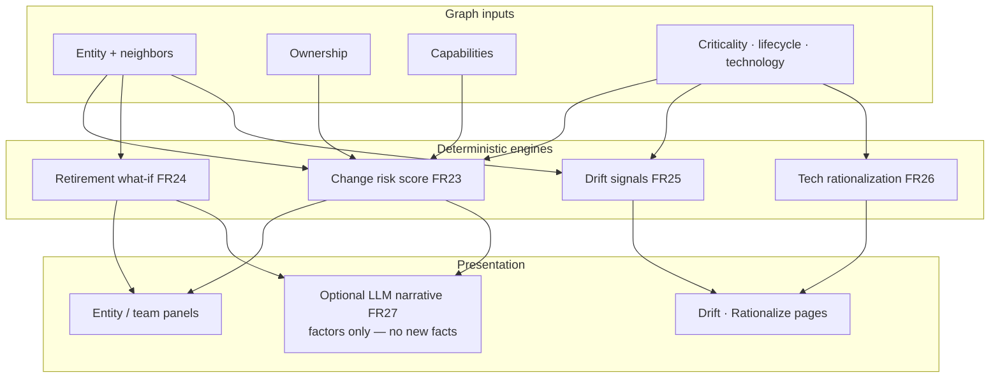

# 07 — Intelligence flow

Deterministic analytics over the same graph; optional narrative is presentation-only.

**Team pages:** risk is a **rollup over owned systems**, not a score of the Team node itself.

What-if is **read-only**—it never mutates Neo4j (`ADR-0008`).
