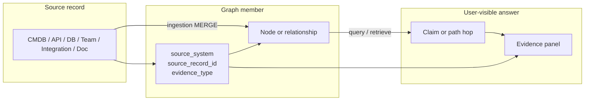
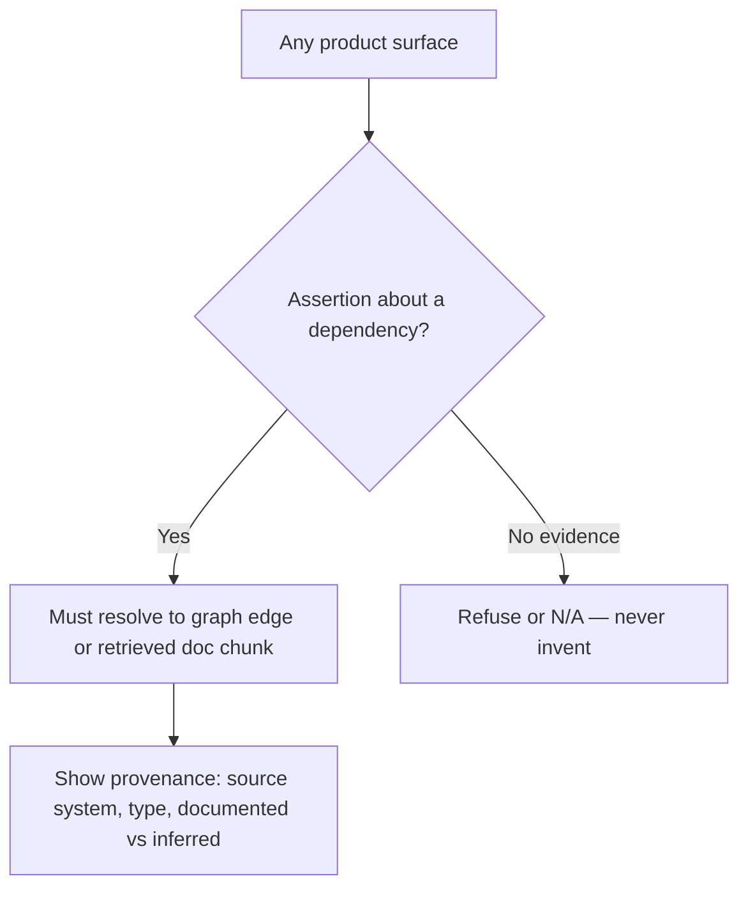

# 08 — Evidence & provenance

How source tags become trust signals in the UI.

Applies to explorer, closed Ask, Graph/Hybrid RAG, Investigate citations, and Intelligence factors (`ADR-0003`, FR12).
